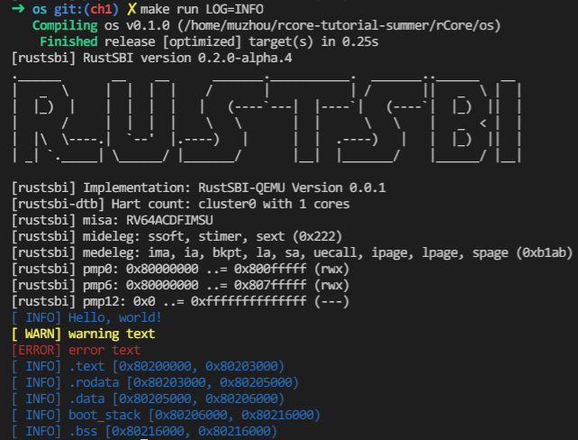

## 运行结果

复现方式：在ch1分支执行图中的命令



## 编程内容

通过 log crate 完成了彩色化LOG，可以通过环境变量控制log等级，默认为关闭

## 问答

1、为了方便 os 处理，Ｍ态软件会将 S 态异常/中断委托给 S 态软件，请指出有哪些寄存器记录了委托信息，rustsbi 委托了哪些异常/中断？（也可以直接给出寄存器的值）

每次rustsbi运行时都会打印 `mideleg` `medeleg` 两个寄存器的信息
```
[rustsbi] mideleg: ssoft, stimer, sext (0x222)
[rustsbi] medeleg: ima, ia, bkpt, la, sa, uecall, ipage, lpage, spage (0xb1ab)
```

2、请学习 gdb 调试工具的使用(这对后续调试很重要)，并通过 gdb 简单跟踪从机器加电到跳转到 0x80200000 的简单过程。只需要描述重要的跳转即可，只需要描述在 qemu 上的情况。

机器上电后位于`0x1000`，在执行几条命令后跳转到`0x80000000`，这里开始就是rustsbi，rustsbi经过初始化后跳转到`0x80200000`

```
0x1000:      auipc   t0,0x0
0x1004:      addi    a1,t0,32
0x1008:      csrr    a0,mhartid
0x100c:      ld      t0,24(t0)
0x1010:      jr      t0
0x1014:      unimp
0x1016:      unimp
0x1018:      unimp
```