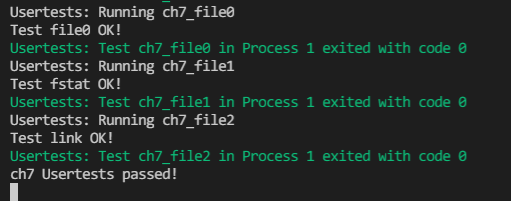

## 运行结果

复现方式：在ch7分支执行 `make test CHAPTER=7`  

## 编程内容

维护了前六章的编程内容  
实现了`sys_linkat`、`sys_unlinkat`和`sys_fstat`，由测例可知其正确性  

## 问答

1、目前的文件系统只有单级目录，假设想要支持多级文件目录，请描述你设想的实现方式，描述合理即可。

2、在有了多级目录之后，我们就也可以为一个目录增加硬链接了。在这种情况下，文件树中是否可能出现环路(软硬链接都可以，鼓励多尝试)？你认为应该如何解决？请在你喜欢的系统上实现一个环路，描述你的实现方式以及系统提示、实际测试结果。