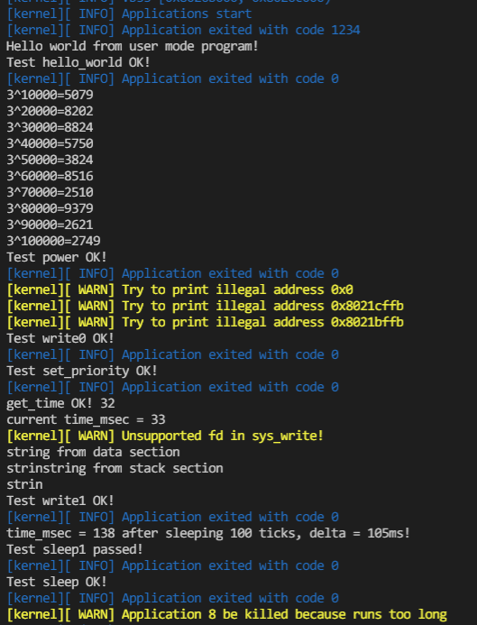
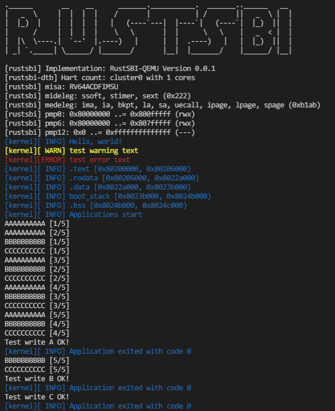
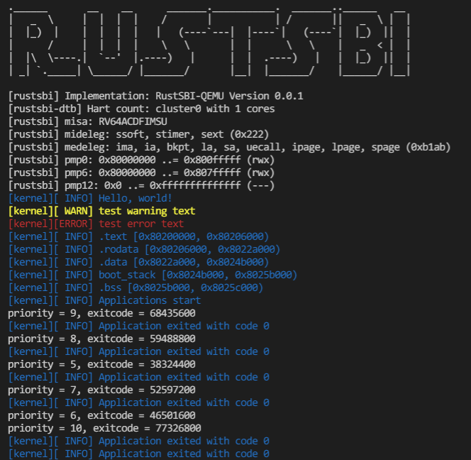

## 运行结果

复现方式：在ch3分支分别执行 `make test CHAPTER=3_0 LOG=INFO`  



`make test CHAPTER=3_2 LOG=INFO`



`make test CHAPTER=3_2 LOG=INFO`



## 编程内容

维护了前两章的编程内容  
实现了对程序执行时间的累计计时并在超时后强制退出，由ch3_0测例可见其效果  
通过`heapless::BinaryHeap`实现了stride调度算法，由ch3_2测例可见其正确性  

## 问答

1、简要描述这一章的进程调度策略。何时进行进程切换？如何选择下一个运行的进程？如何处理新加入的进程？

进程主动调用`sys_yield`或timer触发会产生进程切换。  
可以通过时间片轮转或stride算法选择下一个运行的进程。  

2-1、在目前这一章（chapter3）两种调度策略有实质不同吗？考虑在一个完整的 os 中，随时可能有新进程产生，这两种策略是否实质相同？

2-2、其实 C 版调度策略在公平性上存在比较大的问题，请找到一个进程产生和结束的时间序列，使得在该调度算法下发生：先创建的进程后执行的现象。你需要给出类似下面例子的信息（有更详细的分析描述更好，但尽量精简）。同时指出该序列在你实现的 stride 调度算法下顺序是怎样的？

3、stride 算法深入

stride算法原理非常简单，但是有一个比较大的问题。例如两个 pass = 10 的进程，使用 8bit 无符号整形储存 stride， p1.stride = 255, p2.stride = 250，在 p2 执行一个时间片后，理论上下一次应该 p1 执行。实际情况是轮到 p1 执行吗？为什么？

不是，p2.stride 变量溢出导致其值比 p1 小了。

我们之前要求进程优先级 >= 2 其实就是为了解决这个问题。可以证明，在不考虑溢出的情况下, 在进程优先级全部 >= 2 的情况下，如果严格按照算法执行，那么 STRIDE_MAX – STRIDE_MIN <= BigStride / 2。为什么？尝试简单说明

优先级在 [2,256) 区间时 pass 在 [1, 128) 区间。仅考虑只有两个优先级分别为 2 和 255 的 ab 进程，则 ab 的pass分别为 127 和 1，则b进程每获得127次时间片a进程获得一次时间片，在a进程运行一次后两个进程的stride差值最大，为 127。

已知以上结论，考虑溢出的情况下，我们可以通过设计 Stride 的比较接口，结合 BinaryHeap 的 pop 接口可以很容易的找到真正最小的 Stride。请补全如下 partial_cmp 函数（假设永远不会相等）。

```rust
use core::cmp::Ordering;

struct Stride(u64);

impl PartialOrd for Stride {
    fn partial_cmp(&self, other: &Self) -> Option<Ordering> {
        let mid = BIG_STRIDE / 2;
        if self.0 <= mid && mid < other.0 {
            Some(Ordering::Greater)
        } else if self.0 > mid && mid >= other.0 {
            Some(Ordering::Less)
        } else {
            self.0.cmp(other.0)
        }
    }
}

impl PartialEq for Person {
    fn eq(&self, other: &Self) -> bool {
        false
    }
}
```