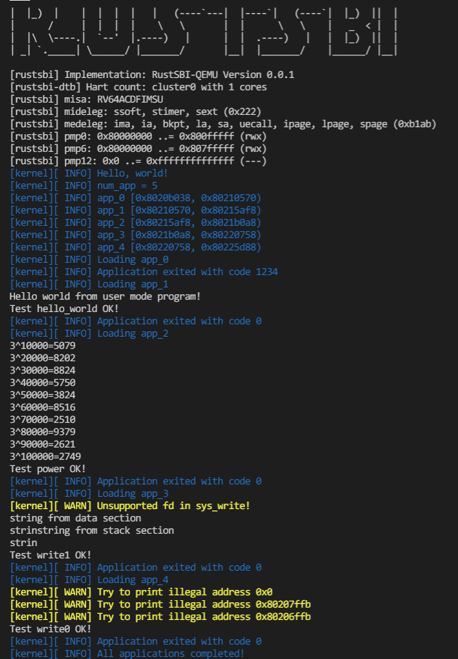
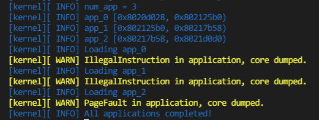

## 运行结果

从第二章开始将会直接展示测例的运行结果。  
复现方式：在ch2分支中，首先修改`batch.rs`中的栈大小，然后执行 `make test CHAPTER=2 LOG=INFO`



`make test CHAPTER=2_bad LOG=INFO`



## 编程内容

通过修改`build.rs`和`Makefile`实现了对测例的支持，具体内容在[第二章笔记](第二章笔记.md)-增加对测例的支持。  
维护了第一章实现的log功能  
通过判断地址实现了`sys_write`函数的安全检查  

## 问答

1、正确进入 U 态后，程序的特征还应有：使用 S 态特权指令，访问 S 态寄存器后会报错。目前由于一些其他原因，这些问题不太好测试，请同学们可以自行测试这些内容（参考前三个测例 )，描述程序出错行为，同时注意注明你使用的 sbi 及其版本。

这些行为都会触发 Trap 来到 U 态的trap处理函数，我的处理方式是打印warning log后直接加载下一个程序

2、请结合用例理解 trap.S 中两个函数 `__alltraps` 和 `__restore` 的作用，并回答如下几个问题:

L40: 刚进入 `__restore` 时，`a0` 代表了什么值。请指出 `__restore` 的两种使用情景。

内核栈的起始地址。在上一个程序调用sys_exit或程序由于越权访问被强制停止时都需要使用`__restore`

L46-L51: 这几行汇编代码特殊处理了哪些寄存器？这些寄存器的的值对于进入用户态有何意义？请分别解释。
```asm
ld t0, 32*8(sp)
ld t1, 33*8(sp)
ld t2, 2*8(sp)
csrw sstatus, t0
csrw sepc, t1
csrw sscratch, t2
```

sstatus 保存了全局中断使能  
sepc 保存了产生异常的指令地址  
sscratch 用于暂存，这里暂存的是用户栈指针  
这些寄存器保证了正确返回系统调用前的位置，并且下一次可以正确触发trap

L53-L59: 为何跳过了 x2 和 x4？
```asm
ld x1, 1*8(sp)
ld x3, 3*8(sp)
.set n, 5
.rept 27
   LOAD_GP %n
   .set n, n+1
.endr
```

x2是sp寄存器，在之后需要使用。x4是tp，一般不会被用到

L63: 该指令之后，`sp` 和 `sscratch` 中的值分别有什么意义？
```asm
csrrw sp, sscratch, sp
```

该指令的效果是交换 sp 和 sscratch 寄存器的值，一个保存了内核栈指针一个保存了用户栈指针，这个指令实现了换栈

__restore：中发生状态切换在哪一条指令？为何该指令执行之后会进入用户态？

`sret` 指令的作用是：

- CPU 会将当前的特权级按照 sstatus 的 SPP 字段设置为 U 或者 S ；
- CPU 会跳转到 sepc 寄存器指向的那条指令，然后开始向下执行。

3、程序陷入内核的原因有中断和异常（系统调用），请问 riscv64 支持哪些中断 / 异常？如何判断进入内核是由于中断还是异常？描述陷入内核时的几个重要寄存器及其值。

`scause` 寄存器保存了异常原因，通过读取该寄存器即可判断。

4、对于任何中断， __alltraps 中都需要保存所有寄存器吗？你有没有想到一些加速 __alltraps 的方法？简单描述你的想法。