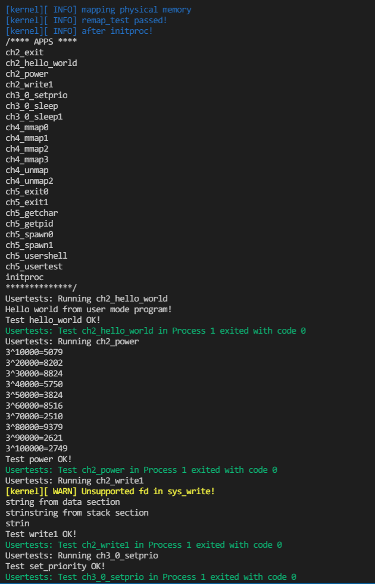

## 运行结果

复现方式：在ch5分支执行 `make test CHAPTER=5 LOG=INFO`




## 编程内容

维护了前四章的编程内容  
由于有了shell的概念，移除了对程序运行时间的限制  
实现了`sys_spawn`，由于测例是基于该系统调用运行测试的，所以测例正常运行可说明正确性  

## 问答

1、fork + exec 的一个比较大的问题是 fork 之后的内存页/文件等资源完全没有使用就废弃了，针对这一点，有什么改进策略？

fork时对页数据延迟映射与复制

2、其实使用了题(1)的策略之后，fork + exec 所带来的无效资源的问题已经基本被解决了，但是今年来 fork 还是在被不断的批判，那么到底是什么正在”杀死”fork？

3、fork 当年被设计并称道肯定是有其好处的。请使用 带初始参数 的 spawn 重写如下 fork 程序，然后描述 fork 有那些好处。注意:使用”伪代码”传达意思即可，spawn 接口可以自定义。可以写多个文件。

```rust
fn main() {
    let a = get_a();
    spawn("another file".main, a)
    println!("a = {}", a);
    0
}

// another file
fn main(a: Type) {
    let b = get_b();
    println!("a + b = {}", a + b);
    exit(0);
}
```

fork的一个好处就是可以将两个逻辑分支较晚或需要传递的参数非常复杂时让代码更简洁，在编写时看起来只是一个简单的分支结构。

4、描述进程执行的几种状态，以及 fork/exec/wait/exit 对于状态的影响。

目前的实现中进程有 Ready、Running、Zombie 三种状态。  
fork 不会改变当前进程的 Running 状态，新进程处于 Ready 状态  
exec/wait 会将当前进程改为 Ready 状态  
exit 会将当前进程改为 Zombie 状态