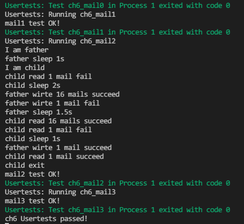

## 运行结果

复现方式：在ch6分支执行 `make test CHAPTER=6`

## 编程内容

维护了前五章的编程内容  
实现了`sys_mailread`和`sys_mailwrite`，由测例可知其正确性  

## 问答

1、举出使用 pipe 的一个实际应用的例子。

grep、less 等命令非常依赖于管道的功能。

2-1、假设你的邮箱实现没有使用锁等机制进行保护，在多核情景下可能会发生哪些问题？单核一定不会发生问题吗？为什么？

可能会发生邮件顺序混乱的问题，在邮箱空和邮箱满的判断上也会出现错误。单核时如果在内核态不会触发中断则不会发生问题，若会触发则依然可能出问题。

2-2、请结合你在课堂上学到的内容，描述读者写者问题的经典解决方案，必要时提供伪代码。

2-3、由于读写是基于报文的，不是随机读写，你有什么点子来优化邮箱的实现吗？

在收发报文时延迟复制，特别是在接收报文时，收件方可以一段一段地接收报文而不是一次性全部接收。  
还可以实现当邮箱内容较多时将部分内容转移至硬盘以节省内存空间。