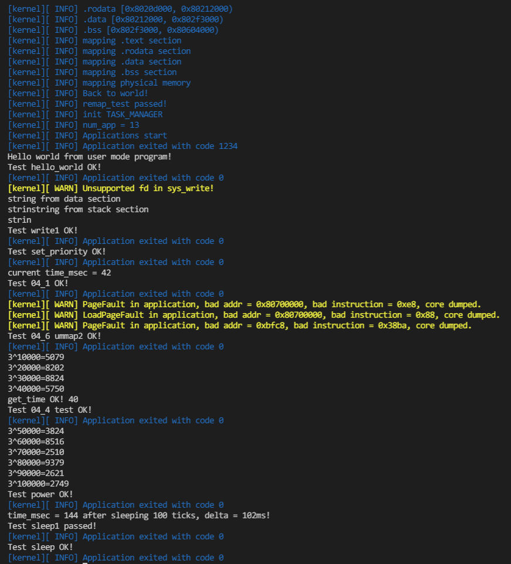

## 运行结果

复现方式：在ch4分支中首先修改所有第四章测例申请的起始地址为`0x80700000`，执行 `make test CHAPTER=4 LOG=INFO`

## 编程内容

维护了前三章的编程内容  
由于虚拟内存本身已经做到了对程序访问地址的限制，所以移除了`sys_write`函数的地址检查  
完成了相对于要求没有那么简化的`sys_mmap`和`sys_munmap`，在满足要求的基础上映射了相同的物理内存位置，因此测例中默认的地址由于不是内存所以会造成PageFault  

## 问答

1、请列举 SV39 页表页表项的组成，结合课堂内容，描述其中的标志位有何作用／潜在作用？

2、缺页

请问哪些异常可能是缺页导致的？发生缺页时，描述相关的重要寄存器的值

PageFault可能是因为缺页或访问权限不足。

Lazy 策略有哪些好处？

一方面可以减小物理内存的占用，另一方面可以让进程更快地启动，也减少了调用方的阻塞时间。

请问处理 10G 连续的内存页面，需要操作的页表实际大致占用多少内存(给出数量级即可)？

由于可以最多一个节点表示 1G 连续内存的映射，所以 10G 连续的内存页面的页表可能会在 100KB 左右

请简单思考如何才能在现有框架基础上实现 Lazy 策略，缺页时又如何处理？

比较粗暴的方式是在创建新的内存空间时只实例化`MapArea`而不映射，只映射并复制入口地址所在的页，在之后每产生缺页即将所缺的页映射并复制数据。  
然后可以通过一些算法每次处理一段连续的页而不是单个页。

内存页面可能被换到磁盘上了，导致对应页面失效。此时页面失效如何表现在页表项(PTE)上？

可以通过对 R/W/X 置零防止访问

3、双页表与单页表

如何更换页表？

修改 `satp` 寄存器

单页表情况下，如何控制用户态无法访问内核页面？

在页表项中内核页的 U 置零

单页表有何优势？

更换页表会导致TLB失效，在trap频繁的场景下单页表在trap时不需要更换页表，性能比较高

双页表实现下，何时需要更换页表？假设你写一个单页表操作系统，你会选择何时更换页表？

双页表实现下任何内核态与各个进程的用户态互相切换时都需要更换页表。单页表则可以只在进程切换时更换页表。